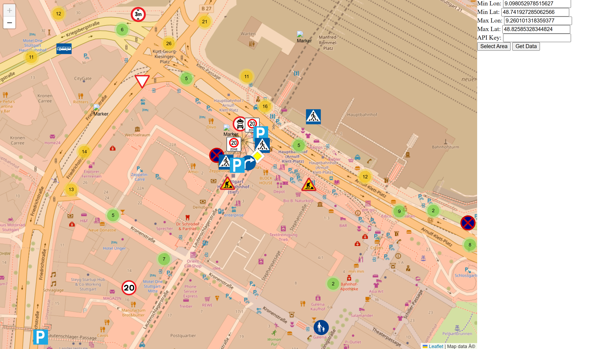

# mapillary-ts-downloader
Downloads all trraffic signs in a selected area from Mapillary to a .json file and shows them on a map.
Uses a locally run flask development server as backend.



## Installation
To install and run this program, you’ll need to have Python and Flask installed on your computer. Here’s a step-by-step guide to help you get started:

1. **Install Python**: If you don’t already have Python installed on your computer, you can download it from the official [Python website](https://www.python.org/downloads/). Follow the instructions for your operating system to install Python.

1. **Create a virtual environment**: It’s a good practice to create a virtual environment for your Python projects to keep their dependencies isolated from each other. To create a virtual environment for this program, open a command prompt or terminal window and navigate to the directory where you want to create the virtual environment. Then, run the following command:

    ```powershell
    python -m venv myenv
    ```

    This will create a new virtual environment in a directory named myenv. You can replace myenv with any name you like.

1. **Activate the virtual environment**: Before you can install any dependencies or run the program, you’ll need to activate the virtual environment. The command to do this depends on your operating system:

    On Windows, run the following command:
    ```powershell
    myenv\Scripts\activate
    ```

    On macOS or Linux, run the following command:

    ```bash
    source myenv/bin/activate
    ```

    Make sure to replace myenv with the name of your virtual environment.

1. **Install Flask and other dependencies**: Once you have activated the virtual environment, you can install Flask and any other dependencies required by the program using the pip command. For example, if the program requires Flask and Flask-CORS, you can run the following command to install them:

    ```powershell
    pip install Flask Flask-CORS requests vt2geojson
    ```

1. **Clone this repository**: Clone this repository to your machine.

1. **Run the Flask app**: Open a command prompt or terminal window and navigate to the directory where you saved the program files. Then, run the following command to start the Flask app:

    ```powershell
    python flask_local.py
    ```

    This will start the Flask app and it will be accessible at http://localhost:5000 in your web browser.

1. **Access the website**: Open your file explorer and navigate to the repository. Open index.html with a browser. You should see a map and some input fields for entering data.

1. **API Key**: The program asks for an API-Key. You can get that on the [Mapillary Website](https://www.mapillary.com/developer). If you don't want to register there you can use the public key from the Mapillary Web App as found in the main.js. All Mapillary Tokens start with MLY.

That’s it! You should now be able to use the program by selecting an area and clicking the “Get Data” button. The program will perform a calculation and display the results on the map.
